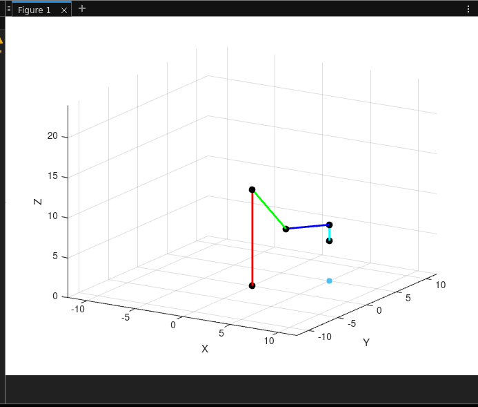

# inverse and direct kinematic of a 4-dof robot arm

This repository contains MATLAB scripts for solving the forward and inverse kinematics of a robotic arm using Denavit-Hartenberg (DH) parameters.



The image represent four links starting with the base link in Red to the end effector in Cyan, and also a projection point on the 2D plane.

## Files

- `MGD_MGI.m`: Main script to calculate the forward and inverse kinematics.
- `DHmethod.m`: Function to create the DH transformation matrix for each joint.

## Usage

1. Clone the repository:
    ```bash
    git clone https://github.com/ChehabiMed/inverse-kinematic-4-dof-robot-arm.git
    cd inverse-kinematic-4-dof-robot-arm
    ```

2. Open MATLAB and navigate to the repository directory.

3. Ensure both `MGD_MGI.m` and `DHmethod.m` are in the same directory.

4. Run the `MGD_MGI.m` script to calculate the forward and inverse kinematics.

## MGD_MGI.m

This script performs the following tasks:

1. **Initialization**:
    - Clears previous variables.
    - Defines the lengths of the arm segments and the target end-effector position.

3. **Symbolic Variables**:
    - Defines the symbolic variables for the DH parameters.

4. **Forward Kinematics**:
    - Computes the DH transformation matrices for each joint.
    - Multiplies the matrices to get the overall transformation matrix from the base to the end-effector.

5. **Inverse Kinematics**:
    - Computes the joint angles required to reach the target end-effector position using inverse kinematics.

6. **Visualization**:
    - Plots the robotic arm in 3D space.

## DHmethod.m

This function creates the DH transformation matrix for a given joint. It takes the following parameters:

- `a`: Link length.
- `alpha`: Link twist.
- `d`: Link offset.
- `theta`: Joint angle.

The function returns the 4x4 DH transformation matrix.


To see the robotic arm in action, run the `MGD_MGI.m` script. The script will output the transformation matrix and plot the arm in 3D space.

